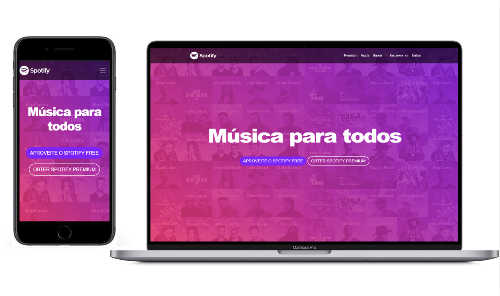

<h1 align="center">
    
</h1>

<h4 align="center">
  ♪ Clone Spotify
</h4>

  
  
  

  

  <a href="#rocket-tecnologias">Tecnologias</a>&nbsp;&nbsp;&nbsp;|&nbsp;&nbsp;&nbsp;
  <a href="#-projeto">Projeto</a>&nbsp;&nbsp;&nbsp;&nbsp;&nbsp;&nbsp;

 

  

## :rocket: Tecnologias

Esse projeto foi desenvolvido com as seguintes tecnologias:

- [HTML5](https://www.w3schools.com/html/)
- [CSS3](https://www.w3schools.com/css/)
- [Bootstrap 4](https://getbootstrap.com/)

## 💻 Projeto

Este projeto foi desenvolvido no decorrer do curso "Curso completo de Desenvolvimento Web - Crie 6 projetos" fornecido pelos professores Jorge Sant Ana e Jamilton Damasceno disponível na plataforma Udemy.

